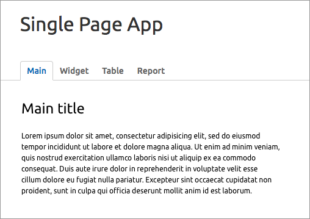
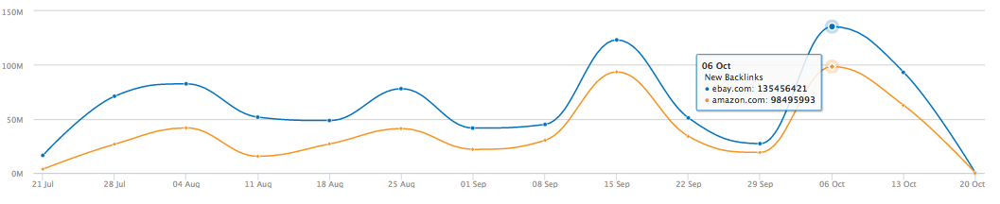
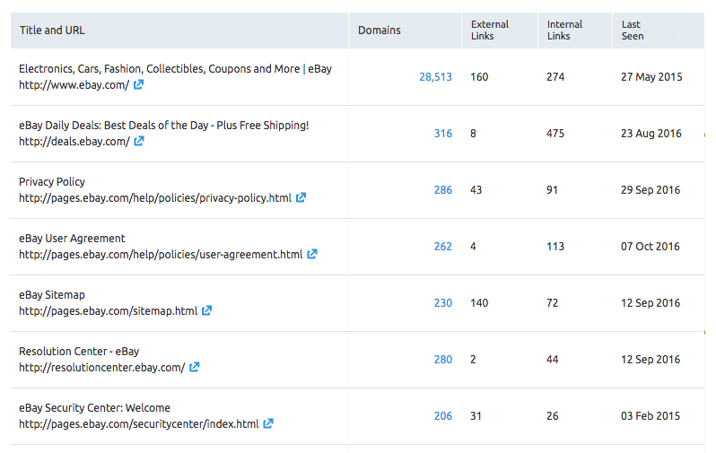

# Создать Сингл-пейдж

В качестве тестового задания предлагаем вам создать небольшое одностраничное приложение.
Рекомендуемые библиотеки Marionette, Backbone, jQuery, highcharts. Однако мы не ограничиваем вашу фантазию, принимаются реализации на любом фреймворке и чистом javascript.

Вызовы api допускается заменить обращениями к json файлам или имитацией инлайн кодом.



# Описание страниц:

## 1\. Main

Страница с заголовком и текстом. Данные страница подтягиваются из API

_/api/main_

```json
{
        "title": "Main title",
        "text": "Lorem ipsum dolor sit amet, consectetur adipisicing elit, sed do eiusmod
tempor incididunt ut labore et dolore magna aliqua. Ut enim ad minim veniam,
quis nostrud exercitation ullamco laboris nisi ut aliquip ex ea commodo
consequat. Duis aute irure dolor in reprehenderit in voluptate velit esse
cillum dolore eu fugiat nulla pariatur. Excepteur sint occaecat cupidatat non
proident, sunt in culpa qui officia deserunt mollit anim id est laborum."
}
```

## 2\. Widget

Страница графиком highcharts spline. Данные для графика должны подгружаться из API

_/api/metrics_

```json
[
    {
        "name": "ebay.com",
        "data": [100, 200, 300, 400, 500, 500, 600]
    },
    {
        "name": "amazon.com",
        "data": [600, 500, 500, 400, 300, 200, 100]
    }
]
```

_highcharts spline_ 

## 3\. Table

На странице Table отрисовать таблицу данные подтянуть из API _/api/table_

_макет_


_/api/table_

```json
[
    {
        "rank": 41032,
        "backlinks_num": 3971886,
        "domains_num": 28513,
        "last_seen": 1432740046,
        "external_link_num": 160,
        "internal_link_num": 274,
        "source_url": "http://www.ebay.com/",
        "source_title": "Electronics, Cars, Fashion, Collectibles, Coupons and More | eBay"
    }, {
        "rank": 22393,
        "backlinks_num": 391045,
        "domains_num": 316,
        "last_seen": 1471935176,
        "external_link_num": 8,
        "internal_link_num": 475,
        "source_url": "http://deals.ebay.com/",
        "source_title": "eBay Daily Deals: Best Deals of the Day - Plus Free Shipping!"
    }, {
        "rank": 16780,
        "backlinks_num": 319002,
        "domains_num": 286,
        "last_seen": 1475181228,
        "external_link_num": 43,
        "internal_link_num": 91,
        "source_url": "http://pages.ebay.com/help/policies/privacy-policy.html",
        "source_title": "Privacy Policy"
    }, {
        "rank": 21993,
        "backlinks_num": 298895,
        "domains_num": 262,
        "last_seen": 1475789513,
        "external_link_num": 4,
        "internal_link_num": 113,
        "source_url": "http://pages.ebay.com/help/policies/user-agreement.html",
        "source_title": "eBay User Agreement"
    }, {
        "rank": 16673,
        "backlinks_num": 296101,
        "domains_num": 230,
        "last_seen": 1473680363,
        "external_link_num": 140,
        "internal_link_num": 72,
        "source_url": "http://pages.ebay.com/sitemap.html",
        "source_title": "eBay Sitemap"
    }, {
        "rank": 17938,
        "backlinks_num": 294377,
        "domains_num": 280,
        "last_seen": 1473645524,
        "external_link_num": 2,
        "internal_link_num": 44,
        "source_url": "http://resolutioncenter.ebay.com/",
        "source_title": "Resolution Center - eBay"
    }, {
        "rank": 16291,
        "backlinks_num": 294020,
        "domains_num": 206,
        "last_seen": 1422953905,
        "external_link_num": 31,
        "internal_link_num": 26,
        "source_url": "http://pages.ebay.com/securitycenter/index.html",
        "source_title": "eBay Security Center: Welcome"
    }
]
```

### 4. Report
Страница Report должна содержать виджет и таблицу одновременно. Данные должны грузиться из /api/metrics и /api/table соответственно.
